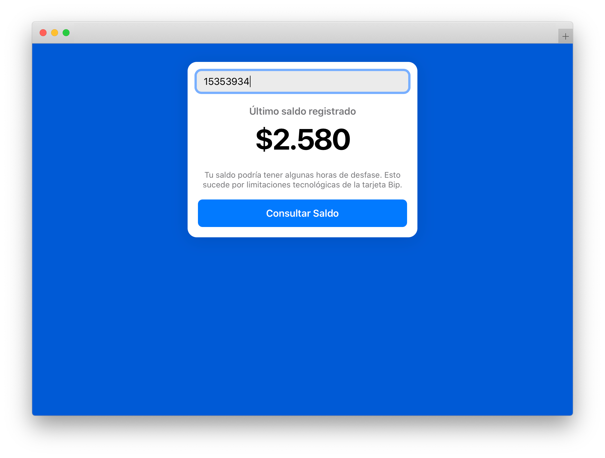
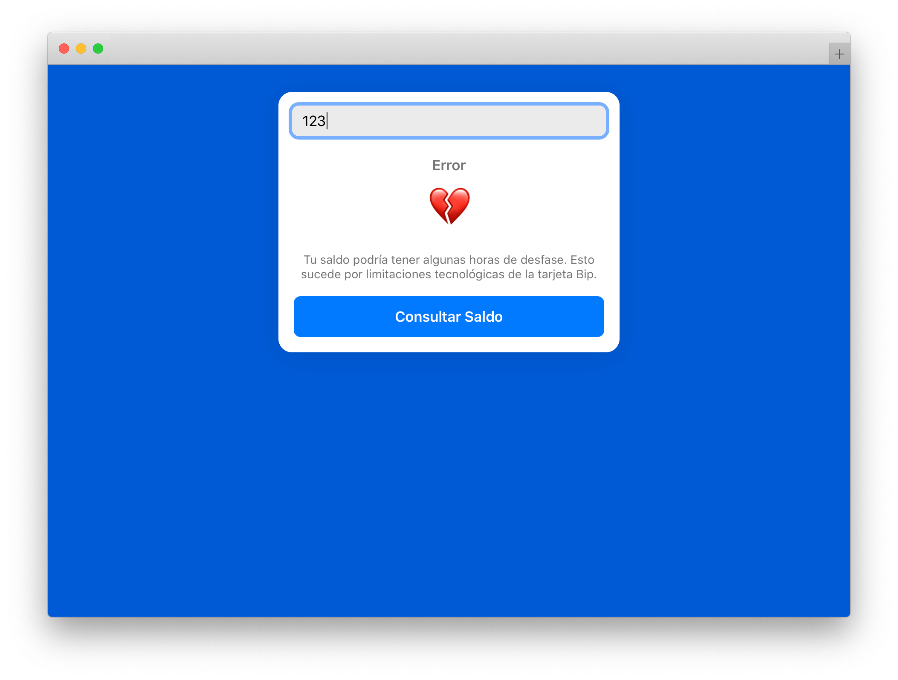

> Since the primary use-case for this project only applies to Chile, a chilean-spanish speaking country, this project uses *Spanglish* as it's primary language.

# SimpleBipApp

### [👉 Demo](https://laurasandoval.github.io/SimpleBipApp/)

 Aplicación web hiper-minimalista para obtener el saldo de una tarjeta Bip. Originalmente lanzada en 2018, luego deprecada en 2019, y finalmente re-escrita en 2020 para hacerla open-source.

 
 

 Cuando la escribí en 2018 tenía muchos errores y la accesibilidad era terrible, así que decidí re-escribirla usando propiedades CSS modernas (como CSS Grid), deprecando librerías antiguas (como Jquery), y mejorando significativamente la accessibilidad para lectores de pantalla y keyboard users.

 Dicho eso, probablemente aún tenga código *mejorable*. No me encargaré de actualizar proactivamente este repo, pero si hay algún fragmento de código en él que no te deje dormir por las noches, estaré feliz de revisarlo.

 # Known Issues
 - El error handling para fallas en el servidor probablemente no es muy bueno.
 - La accesibilidad para lectores de pantalla cuando el request falla (sea porque la tarjeta no es válida o porque algo falló en el servidor) es terrible. Usable, pero notablemente mala.

 # API
Este proyecto usa la maravillosa API que armamos con [@riverosroca](https://github.com/riverosroca) (en realidad la escribió él, yo solo le conté que había una fuente más actualizada que el clásico y añejo `pocae` para obtener el saldo de la Bip, y que no había ninguna API pública que apuntara ahí).

# Permisos
Eres libre de copiar, modificar, fusionar, publicar, criticar, apoyar, vivir con, y hasta tomarte un cafecito con el código de este proyecto si así lo deseas.

Como la API es de [@riverosroca](https://github.com/riverosroca), los permisos para usarla dependen de él. Pero me dijo que no había problema en hacerla pública :)